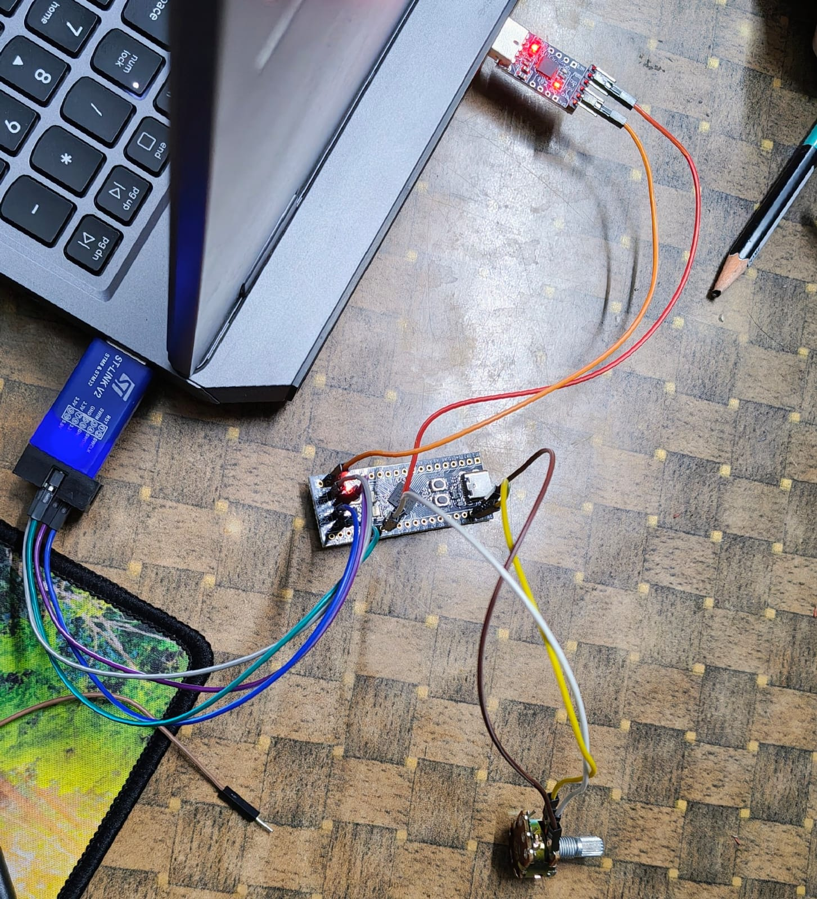

# STM-32 Bare-Metal Drivers

This repository contains bare-metal C drivers for the STM32 microcontroller series. These drivers focus on direct register-level manipulation, avoiding the overhead of hardware abstraction layers (HAL) to provide a deeper understanding of the microcontroller's core peripherals.

## 1. Analog-to-Digital Converter (ADC) Driver

This project includes a complete bare-metal ADC driver configured for the STM32F411 microcontroller. This driver enables the microcontroller to read continuous analog voltage signals (like those from a potentiometer or temperature sensor) and convert them into discrete digital values for processing.

### Key Features
*   **Single-Channel Conversion:** Configures GPIO pin **PA1** to operate in analog mode, routing the input signal to ADC1 Channel 1.
*   **Continuous Conversion Mode:** The ADC is set to automatically restart the sampling and conversion process as soon as the previous one finishes, providing a continuous stream of real-time data.
*   **Hardware Polling:** The driver utilizes the End of Conversion (EOC) hardware flag in the ADC Status Register (`ADC_SR`) to verify that data is ready before reading from the Data Register (`ADC_DR`).
*   **Serial UART Output:** Integrates a custom UART driver to transmit the 12-bit digital values (ranging from `0` to `4095`) over a USB-to-TTL adapter. 

### ADC Hardware Setup
*   **Analog Source (Potentiometer):** Left pin to **3.3V**, Right pin to **GND**, Middle pin to **PA1**.
*   **CP2102 USB-to-TTL Adapter:** **GND** to STM32 **GND**, **RXD** to STM32 **PA2** (TX pin).
*   **ST-Link V2 Programmer:** Connected via SWD (`3V3`, `GND`, `SWDIO`, `SWCLK`).

### Screenshots
#### Hardware Connection

*Image showing the STM32 board connected to the ST-Link programmer, CP2102 UART adapter, and the potentiometer.*

#### Serial Terminal Output

*Image showing the live 12-bit digital values streaming into a serial terminal.*

---

## 2. Direct Register Manipulation (LED Blink)

This module demonstrates the absolute fundamentals of embedded programming: manipulating hardware directly via memory addresses. Instead of relying on CMSIS device headers, this project manually defines the hexadecimal memory addresses for the Reset and Clock Control (RCC) and GPIO Port A registers. 

By mapping these absolute addresses to volatile pointers, the code directly interacts with the silicon, enabling the GPIO clock, configuring the mode of pin PA5, and continuously toggling the onboard LED using a basic software loop delay.

---

## 3. General Purpose Timer (TIM2 1Hz Delay)

Building upon the previous module, this section eliminates inefficient software delays by leveraging a dedicated hardware timer (TIM2). The code configures the timer to generate a precise 1Hz (1-second) interval by properly setting the timer's prescaler and auto-reload values based on the system's clock frequency.

### Hardware Behavior Notes
*   **Independent Hardware:** Once the initialization function enables the timer's counter, the hardware counts continuously and independently. It requires zero involvement from the main application loop to keep time.
*   **The UIF Flag:** The Update Interrupt Flag (UIF) serves as an automated hardware notification. When the timer overflows, the hardware automatically sets this flag to 1, acting like a mailbox flag to signal the event.
*   **Flag Management:** While the hardware automatically raises the flag, the software is responsible for acknowledging it. The main loop must manually clear the flag back to 0 before the next overflow event occurs.

---

## Installation and Usage

1.  **Clone the repository:**
    
```bash
    git clone [https://github.com/KrishChalana/stm-32-Drivers.git](https://github.com/KrishChalana/stm-32-Drivers.git)
